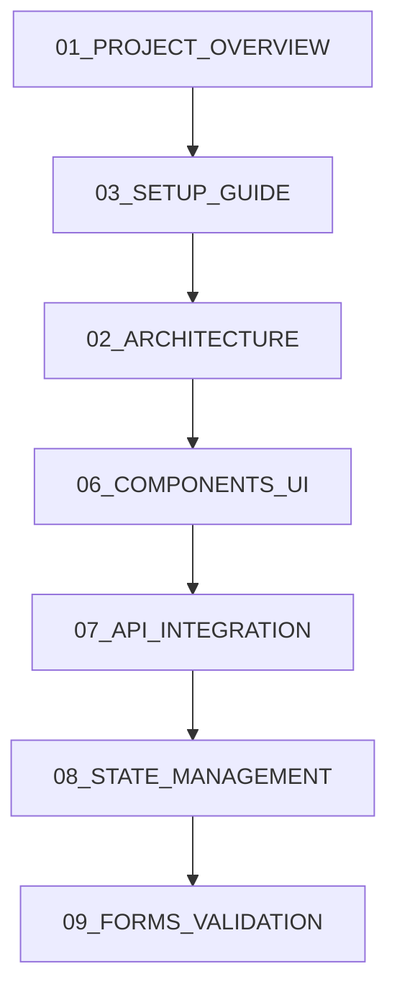
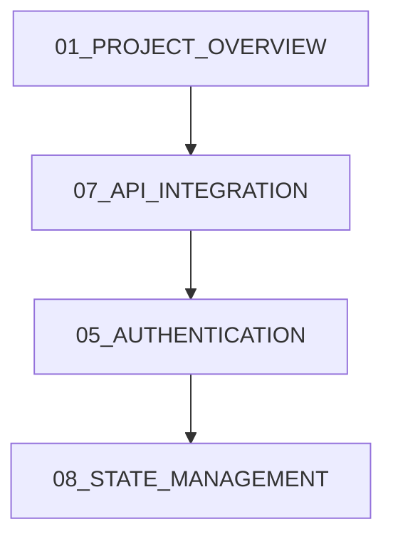
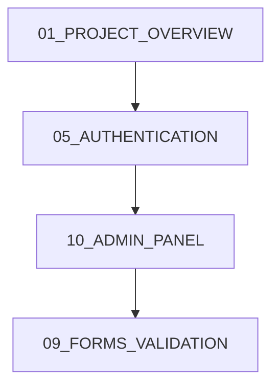

# 📚 Açık Atölye E-Ticaret Frontend - Proje Dokümantasyonu

Hoş geldiniz! Bu klasör **Açık Atölye E-Ticaret Frontend** projesi için kapsamlı geliştirici dokümantasyonunu içerir.

## 🎯 Dokümantasyon Amacı

Bu dokümantasyon seti, yeni katılan frontend geliştiricilerin projeyi hızla anlaması ve geliştirmeye katkı sağlayabilmesi için oluşturulmuştur. Ayrıca **Cursor IDE** kullanıcıları için özel optimizasyonlar içerir.

## 📋 Doküman Listesi

### 🏗️ Temel Altyapı
| Doküman | Açıklama | Durum |
|---------|----------|-------|
| [01_PROJECT_OVERVIEW.md](./01_PROJECT_OVERVIEW.md) | Proje genel bakış, teknoloji stack, hedefler | ✅ |
| [02_ARCHITECTURE.md](./02_ARCHITECTURE.md) | Sistem mimarisi, katmanlar, design patterns | ✅ |
| [03_SETUP_GUIDE.md](./03_SETUP_GUIDE.md) | Kurulum rehberi, geliştirme ortamı setup | ✅ |

### 🧭 Navigasyon ve Routing
| Doküman | Açıklama | Durum |
|---------|----------|-------|
| [04_ROUTING_NAVIGATION.md](./04_ROUTING_NAVIGATION.md) | Next.js App Router, sayfa yapısı, navigasyon | ✅ |

### 🔐 Güvenlik ve Kimlik Doğrulama
| Doküman | Açıklama | Durum |
|---------|----------|-------|
| [05_AUTHENTICATION.md](./05_AUTHENTICATION.md) | JWT auth, role-based access, token management | ✅ |

### 🧩 UI ve Bileşenler
| Doküman | Açıklama | Durum |
|---------|----------|-------|
| [06_COMPONENTS_UI.md](./06_COMPONENTS_UI.md) | ShadCN/UI, design system, component library | ✅ |

### 🔌 API ve Data Management
| Doküman | Açıklama | Durum |
|---------|----------|-------|
| [07_API_INTEGRATION.md](./07_API_INTEGRATION.md) | Axios client, TanStack Query, API services | ✅ |
| [08_STATE_MANAGEMENT.md](./08_STATE_MANAGEMENT.md) | Zustand stores, state architecture | ✅ |

### 📝 Forms ve Validation
| Doküman | Açıklama | Durum |
|---------|----------|-------|
| [09_FORMS_VALIDATION.md](./09_FORMS_VALIDATION.md) | React Hook Form, Zod validation, form patterns | ✅ |

### 🛒 Business Logic
| Doküman | Açıklama | Durum |
|---------|----------|-------|
| [10_ADMIN_PANEL.md](./10_ADMIN_PANEL.md) | Admin dashboard, ürün yönetimi, admin features | 🚧 |
| [11_ECOMMERCE_FEATURES.md](./11_ECOMMERCE_FEATURES.md) | Sepet, ödeme, ürün listesi, e-ticaret flow | 🚧 |

### 🚀 Deployment ve Süreçler
| Doküman | Açıklama | Durum |
|---------|----------|-------|
| [12_DEPLOYMENT.md](./12_DEPLOYMENT.md) | Build, deployment, environment setup | 🚧 |
| [13_DEVELOPMENT_GUIDELINES.md](./13_DEVELOPMENT_GUIDELINES.md) | Code standards, best practices, conventions | 🚧 |

### 🔧 Troubleshooting ve Tools
| Doküman | Açıklama | Durum |
|---------|----------|-------|
| [14_TROUBLESHOOTING.md](./14_TROUBLESHOOTING.md) | Common issues, debugging, FAQ | 🚧 |
| [15_CURSOR_INTEGRATION.md](./15_CURSOR_INTEGRATION.md) | Cursor IDE setup, extensions, workflow | 🚧 |

## 🚀 Hızlı Başlangıç

### Yeni Geliştirici İçin 5 Dakikada Başlangıç

1. **Proje Genel Bakış**: [01_PROJECT_OVERVIEW.md](./01_PROJECT_OVERVIEW.md)
2. **Kurulum**: [03_SETUP_GUIDE.md](./03_SETUP_GUIDE.md) - Environment setup
3. **Mimari**: [02_ARCHITECTURE.md](./02_ARCHITECTURE.md) - Proje yapısını anlama
4. **İlk Sayfa**: [04_ROUTING_NAVIGATION.md](./04_ROUTING_NAVIGATION.md) - Sayfa oluşturma

### Frontend Geliştirici İçin



### Backend Entegrasyonu İçin



### Admin Panel Geliştirme



## 🛠️ Teknoloji Stack

### Core Technologies
- **Framework**: Next.js 15 (App Router)
- **Language**: TypeScript
- **Styling**: Tailwind CSS + ShadCN/UI
- **State Management**: Zustand + TanStack Query
- **Forms**: React Hook Form + Zod
- **HTTP Client**: Axios

### Development Tools
- **IDE**: Cursor (recommended)
- **Linting**: ESLint + Prettier
- **Testing**: Jest + React Testing Library
- **Version Control**: Git + GitHub

## 📚 Doküman Kategorileri

### 🏗️ Altyapı ve Mimari
Projenin temel yapısı, teknoloji seçimleri ve mimari kararlar.

### 🔧 Geliştirme Araçları
Kurulum, konfigürasyon, IDE setup ve development workflow.

### 💻 Frontend Özellikleri
UI/UX, component sistemi, state management ve form handling.

### 🔌 Entegrasyon
API entegrasyonu, authentication ve third-party services.

### 🛒 Business Logic
E-ticaret özellikleri, admin panel ve domain-specific logic.

### 🚀 Operations
Deployment, monitoring, troubleshooting ve maintenance.

## 📖 Dokümantasyon Kuralları

### Doküman Formatı
- Her doküman **Markdown** formatında
- **Emoji** kullanarak kategorileme
- **Code blocks** ile örnekler
- **Mermaid diagrams** ile görselleştirme

### Güncelleme Süreci
1. Yeni feature eklendiğinde ilgili dokümanları güncelle
2. Breaking changes için migration guide ekle
3. Version numarası ile takip et
4. Son güncelleme tarihini kaydet

### Katkı Sağlama
```bash
# Doküman güncellemesi için
git checkout -b docs/update-routing-guide
# Dokümanı güncelle
git commit -m "docs: update routing navigation guide"
git push origin docs/update-routing-guide
# Pull request aç
```

## 🎯 Doküman Kullanım Rehberi

### Senaryoya Göre Okuma Sırası

#### 🆕 Yeni Katılan Geliştirici
1. [01_PROJECT_OVERVIEW.md](./01_PROJECT_OVERVIEW.md) - Projeyi tanı
2. [03_SETUP_GUIDE.md](./03_SETUP_GUIDE.md) - Ortamı hazırla
3. [15_CURSOR_INTEGRATION.md](./15_CURSOR_INTEGRATION.md) - IDE'yi kurgu
4. [02_ARCHITECTURE.md](./02_ARCHITECTURE.md) - Mimarisini anla
5. [04_ROUTING_NAVIGATION.md](./04_ROUTING_NAVIGATION.md) - Sayfalar arası geçiş

#### 🎨 UI/UX Geliştirici
1. [06_COMPONENTS_UI.md](./06_COMPONENTS_UI.md) - Component sistemi
2. [09_FORMS_VALIDATION.md](./09_FORMS_VALIDATION.md) - Form tasarımı
3. [04_ROUTING_NAVIGATION.md](./04_ROUTING_NAVIGATION.md) - Page navigation

#### 🔧 Backend Entegrasyon
1. [07_API_INTEGRATION.md](./07_API_INTEGRATION.md) - API client setup
2. [05_AUTHENTICATION.md](./05_AUTHENTICATION.md) - Auth flow
3. [08_STATE_MANAGEMENT.md](./08_STATE_MANAGEMENT.md) - Data management

#### 🛒 E-ticaret Features
1. [11_ECOMMERCE_FEATURES.md](./11_ECOMMERCE_FEATURES.md) - Shopping flow
2. [08_STATE_MANAGEMENT.md](./08_STATE_MANAGEMENT.md) - Cart management
3. [09_FORMS_VALIDATION.md](./09_FORMS_VALIDATION.md) - Checkout forms

#### 👑 Admin Panel
1. [10_ADMIN_PANEL.md](./10_ADMIN_PANEL.md) - Admin dashboard
2. [05_AUTHENTICATION.md](./05_AUTHENTICATION.md) - Role-based access
3. [09_FORMS_VALIDATION.md](./09_FORMS_VALIDATION.md) - Admin forms

#### 🚀 DevOps/Deployment
1. [12_DEPLOYMENT.md](./12_DEPLOYMENT.md) - Build & deploy
2. [13_DEVELOPMENT_GUIDELINES.md](./13_DEVELOPMENT_GUIDELINES.md) - Standards
3. [14_TROUBLESHOOTING.md](./14_TROUBLESHOOTING.md) - Issue resolution

## 🔍 Arama ve Navigasyon

### Hızlı Arama
- **Component arıyorsun?** → [06_COMPONENTS_UI.md](./06_COMPONENTS_UI.md)
- **API endpoint?** → [07_API_INTEGRATION.md](./07_API_INTEGRATION.md)
- **Form validation?** → [09_FORMS_VALIDATION.md](./09_FORMS_VALIDATION.md)
- **Routing issue?** → [04_ROUTING_NAVIGATION.md](./04_ROUTING_NAVIGATION.md)
- **Auth problem?** → [05_AUTHENTICATION.md](./05_AUTHENTICATION.md)
- **State management?** → [08_STATE_MANAGEMENT.md](./08_STATE_MANAGEMENT.md)

### Key Terms
| Term | Doküman | Section |
|------|---------|---------|
| `useAuth` | [05_AUTHENTICATION.md](./05_AUTHENTICATION.md) | Custom Hooks |
| `ProductCard` | [06_COMPONENTS_UI.md](./06_COMPONENTS_UI.md) | Feature Components |
| `apiClient` | [07_API_INTEGRATION.md](./07_API_INTEGRATION.md) | Base Configuration |
| `useCartStore` | [08_STATE_MANAGEMENT.md](./08_STATE_MANAGEMENT.md) | Cart Store |
| `productSchema` | [09_FORMS_VALIDATION.md](./09_FORMS_VALIDATION.md) | Validation Schemas |

## 📞 Destek ve İletişim

### Sorularınız için
- **Technical Questions**: İlgili doküman altında issue açın
- **Bug Reports**: [14_TROUBLESHOOTING.md](./14_TROUBLESHOOTING.md) önce kontrol edin
- **Feature Requests**: [13_DEVELOPMENT_GUIDELINES.md](./13_DEVELOPMENT_GUIDELINES.md) contribution guide

### Doküman Geliştirme
- **Missing Info**: Issue açıp eksik bilgiyi belirtin
- **Typos/Errors**: Direct PR gönderin
- **New Sections**: Önce discussion açın

---

**📝 Not**: Bu dokümantasyon sürekli güncellenmektedir. Star ⭐ vermeyi unutmayın!

**Son Güncelleme**: Aralık 2024  
**Doküman Versiyonu**: 1.0  
**Proje Versiyonu**: 0.1.0 